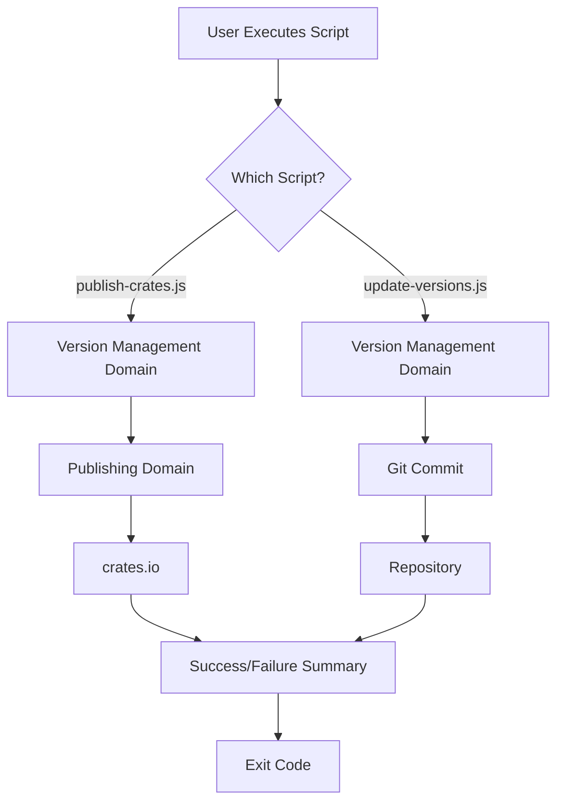
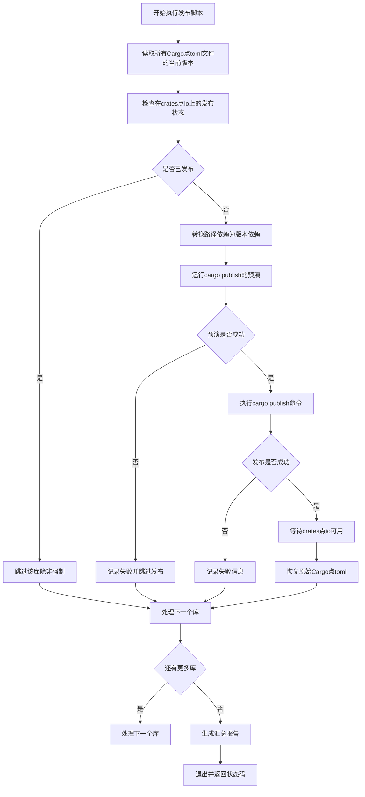
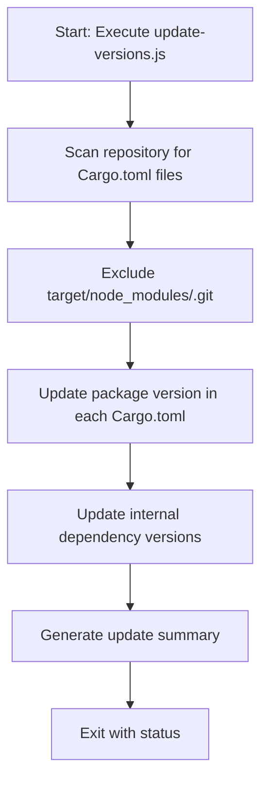
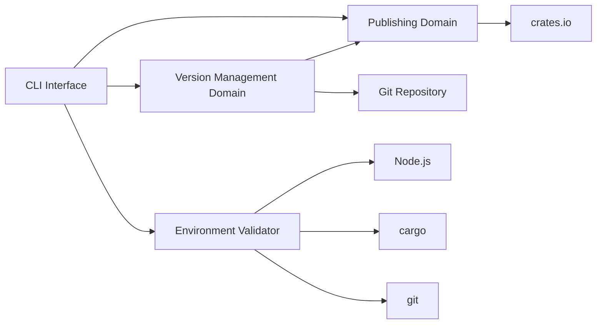
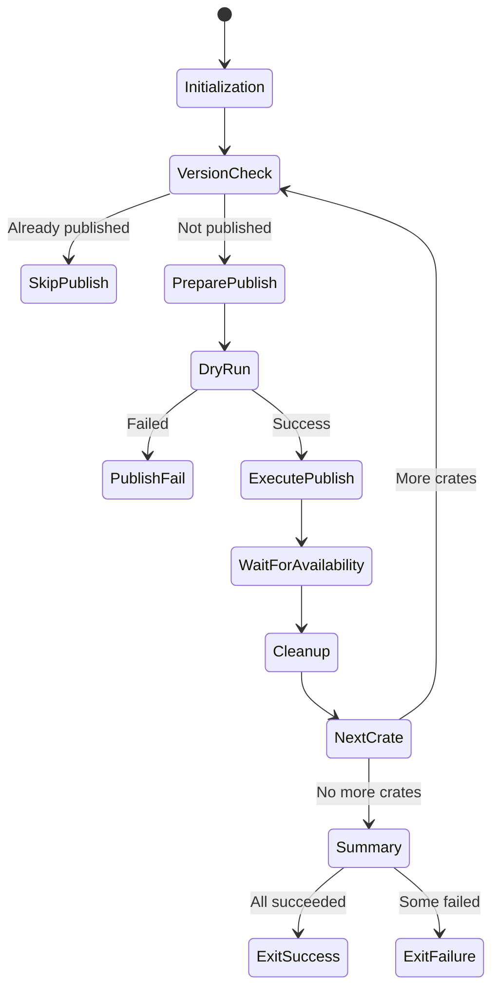
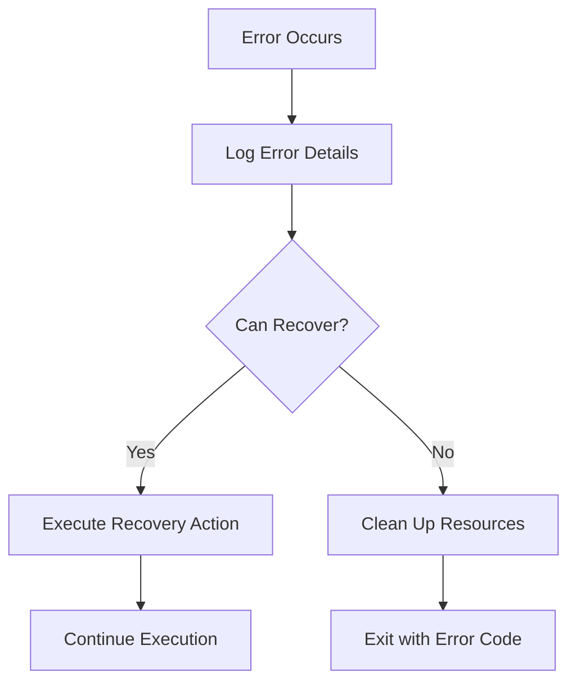
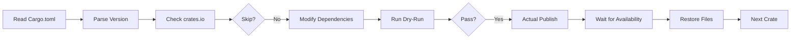

# Core Workflows

## 1. Workflow Overview

The **cortex-mem-publish-tools** system is a Node.js-based CLI automation toolkit designed to streamline the release process for multi-crate Rust projects. It addresses the complexity of managing version consistency and dependency alignment across a monorepo by automating two core workflows: **Rust Crate Publishing** and **Version Update**.

### System Main Workflows
- **Rust Crate Publishing Process**: Orchestrates the full lifecycle of publishing multiple interdependent Rust crates to `crates.io`, including version incrementing, dependency resolution, dry-run validation, actual publishing, and post-publish verification.
- **Version Update Process**: Synchronizes version numbers across all `Cargo.toml` files in the repository, preparing the codebase for a coordinated release.

### Core Execution Paths
The primary execution path begins with the manual invocation of either `publish-crates.js` or `update-versions.js`. These scripts operate in a sequential, deterministic manner:
1. **Environment Setup & Validation**
2. **Manifest Discovery & Parsing**
3. **Version Management & Dependency Resolution**
4. **Action Execution (Publish or Update)**
5. **Result Validation & Reporting**

### Key Process Nodes
| Node | Description | Responsible Module |
|------|-------------|--------------------|
| `Cargo.toml` Scanner | Discovers all crate manifests in the repository | Version Management Domain |
| Version Bumper | Increments or sets version numbers across crates | Version Management Domain |
| Dependency Resolver | Converts path-based dependencies to version-based for publishing | Publishing Domain |
| Cargo Publisher | Executes `cargo publish` commands with proper context | Publishing Domain |
| Crates.io Validator | Confirms crate availability via API polling | Publishing Domain |

### Process Coordination Mechanisms
The system employs a **centralized orchestration model** where the main script (`publish-crates.js`) coordinates execution across functional domains:
- **Data Flow**: Version metadata flows from the Version Management Domain to the Publishing Domain
- **Execution Order**: Crates are processed in predefined dependency order to ensure build integrity
- **State Management**: Temporary file modifications (`.bak` backups) maintain state during publishing
- **Error Propagation**: Failures in any step halt further execution and trigger appropriate cleanup



---

## 2. Main Workflows

### Rust Crate Publishing Process

This is the primary business workflow, enabling reliable, consistent publishing of multiple interdependent Rust crates.

#### Flowchart


#### Key Technical Process Descriptions

**1. Environment Initialization**
- Sets `PROJECT_ROOT` to parent directory of scripts
- Defines ANSI color codes for enhanced terminal output
- Establishes list of crates to publish in dependency order

**2. Version Discovery**
```javascript
function getVersion(cratePath) {
  const cargoTomlPath = path.join(PROJECT_ROOT, cratePath, 'Cargo.toml');
  const content = fs.readFileSync(cargoTomlPath, 'utf8');
  const match = content.match(/^version\s*=\s*"([^"]+)"/m);
  return match ? match[1] : null;
}
```
- Reads `Cargo.toml` synchronously
- Uses regex to extract version field
- Returns semantic version string

**3. Dependency Conversion**
```javascript
function prepareForPublishing(cratePath) {
  // Replace { path = "..." } with { version = "x.y.z" }
  // Creates backup of original file
  // Returns true if changes were made
}
```
- Identifies path dependencies in `Cargo.toml`
- Resolves correct version from target crate
- Modifies manifest temporarily for publishing
- Maintains original state via `.bak` files

**4. Publishing Execution**
- Supports `--dry-run` mode for validation
- Uses `execSync` with `stdio: 'inherit'` to show cargo output
- Implements `--allow-dirty` flag to bypass git dirty checks

**5. Post-Publish Validation**
```javascript
function waitForCrateAvailability(crateName) {
  // Polls crates.io API every 5 seconds
  // Uses curl to check https://crates.io/api/v1/crates/{name}
  // Maximum wait: 120 seconds
}
```
- Ensures published crate is available before proceeding
- Prevents race conditions in dependency resolution
- Allows skipping with `--skip-wait` flag

#### Input/Output Data Flows
| Stage | Input | Output | Side Effects |
|-------|-------|--------|-------------|
| Initialization | CLI arguments (`--dry-run`, `--force`) | Parsed flags, crate list | Console output |
| Version Check | Crate name | Boolean (published status) | API call to crates.io |
| Dependency Prep | Cargo.toml with path deps | Modified Cargo.toml, .bak file | File system modification |
| Publishing | Crate path | Exit code, console output | Network request to crates.io |
| Cleanup | Crate path | Restored Cargo.toml | File system modification |

---

### Version Update Process

A supporting workflow that synchronizes version numbers across all crates in preparation for release.

#### Flowchart


#### Key Technical Process Descriptions

**1. File Discovery**
```javascript
const files = glob.sync('**/Cargo.toml', {
  ignore: ['**/target/**', '**/node_modules/**', '**/.git/**'],
  cwd: process.cwd(),
  absolute: true
});
```
- Uses `glob` package for pattern matching
- Excludes build and system directories
- Returns absolute paths for safe file operations

**2. Version Update**
```javascript
function updateVersionInCargoToml(filePath) {
  // Finds 'version = "x.y.z"' line
  // Replaces with predefined VERSION constant
  // Logs changes with colored output
}
```
- Updates only the package's own version
- Preserves file formatting and comments
- Provides visual feedback on changes

**3. Dependency Synchronization**
```javascript
function updateInternalDependencies(filePath) {
  // Finds dependencies with path references
  // Updates version field if present
  // Targets cortex-mem-* and ../ patterns
}
```
- Focuses on internal project dependencies
- Maintains version consistency across the monorepo
- Handles both explicit version specs and path-only deps

#### Input/Output Data Flows
| Stage | Input | Output | Side Effects |
|-------|-------|--------|-------------|
| File Scan | Glob pattern, exclude rules | List of Cargo.toml paths | None |
| Version Update | Cargo.toml path | Boolean (updated?) | File modification |
| Dependency Update | Cargo.toml path | Boolean (updated?) | File modification |
| Summary | Counters | Formatted report | Console output |

---

## 3. Flow Coordination and Control

### Multi-Module Coordination Mechanisms

The system employs a **flat, script-driven architecture** with clear domain separation:



**Coordination Principles:**
1. **Sequential Execution**: No parallel processing; steps execute in strict order
2. **Data Passing**: Version information passed via function calls and file system
3. **State Management**: Temporary file modifications with backup/restore pattern
4. **Error Handling**: Immediate failure propagation with cleanup

### State Management and Synchronization

| State Type | Mechanism | Scope | Persistence |
|----------|-----------|-------|-----------|
| Version State | In-memory objects, file reads | Per-crate | Transient |
| Dependency Graph | Hardcoded in `CRATES_TO_PUBLISH` | Global | Persistent (code) |
| File State | `.bak` backup files | Per-file | Temporary |
| Execution State | Loop counters, success/fail counters | Global | Transient |

**Synchronization Strategy:**
- **No concurrency**: Single-threaded execution prevents race conditions
- **Atomic file operations**: Backup before modification ensures recoverability
- **Ordered processing**: Dependency order prevents build failures

### Data Passing and Sharing

**Inter-Process Communication:**
- **Function calls**: Direct invocation within same process
- **File system**: `Cargo.toml` as shared data store
- **Environment variables**: Implicit (via `execSync`)
- **Standard I/O**: Console output for status reporting

**Data Contracts:**
- `Cargo.toml` format (TOML)
- Semantic versioning (SemVer)
- Crates.io API response format (JSON)

### Execution Control and Scheduling

**Control Flow:**


**Scheduling Constraints:**
- **Dependency Order**: Crates published in predefined sequence
- **Temporal Dependencies**: Later crates wait for earlier ones to be available
- **Manual Trigger**: No automated scheduling; user-initiated

---

## 4. Exception Handling and Recovery

### Error Detection and Handling

**Error Categories:**
| Type | Detection Method | Handling Strategy |
|------|------------------|-------------------|
| File I/O | try/catch around fs operations | Log error, continue or exit |
| Command Execution | execSync return code | Capture failure, skip crate |
| Network Issues | curl exit code, timeout | Retry with backoff, then fail |
| Validation Failure | Dry run result | Skip publish, restore state |
| Dependency Issues | Missing .bak files | Warning, attempt recovery |

**Error Handling Patterns:**
```javascript
// Pattern 1: Try-Catch with Recovery
try {
  execSync('cargo publish');
  return true;
} catch (error) {
  return false; // Continue with next crate
}

// Pattern 2: Preemptive Validation
if (isCratePublished(crate.name) && !force) {
  skippedCount++;
  continue; // Skip without attempting
}

// Pattern 3: Backup/Restore
fs.copyFileSync(cargoTomlPath, cargoTomlPath + '.bak');
// ... modify file ...
fs.copyFileSync(backupPath, cargoTomlPath); // Always restore
```

### Exception Recovery Mechanisms

**Recovery Strategies:**
1. **File System Recovery**: Always restore original `Cargo.toml` from `.bak`
2. **Partial Success**: Continue publishing other crates after failure
3. **State Cleanup**: Remove temporary modifications regardless of outcome
4. **Graceful Degradation**: Skip non-critical steps (e.g., wait time)

**Recovery Workflow:**


### Fault Tolerance Strategy Design

**Design Principles:**
- **Idempotency**: Scripts can be rerun safely
- **Atomic Operations**: Each crate publish is independent
- **Reversibility**: All modifications can be undone
- **Observability**: Detailed logging at each step

**Fault Tolerance Features:**
- `--dry-run` mode for risk-free validation
- `--force` flag to override publication checks
- `--skip-wait` to bypass availability polling
- Colored output for quick status assessment

### Failure Retry and Degradation

**Retry Mechanism:**
- **Automatic Retry**: None (manual rerun required)
- **Wait for Availability**: 5-second polling with 120-second timeout
- **No Exponential Backoff**: Simple fixed-interval retry

**Degradation Paths:**
1. **Publishing Failure**: Skip crate, continue with others
2. **Wait Timeout**: Log warning, continue anyway
3. **Missing Dependency**: Fail fast, exit with error
4. **File System Error**: Exit immediately

**Exit Codes:**
- `0`: Success (all operations completed)
- `1`: Failure (one or more crates failed)
- `1`: Dependency missing (glob package)

---

## 5. Key Process Implementation

### Core Algorithm Processes

**1. Dependency Resolution Algorithm**
```javascript
function prepareForPublishing(cratePath) {
  // For each line in Cargo.toml
  // Find { path = "..." } patterns
  // Extract dependency name from preceding token
  // Look up version in CRATES_TO_PUBLISH list
  // Replace with { version = "x.y.z" }
}
```
- **Time Complexity**: O(n*m) where n=lines, m=dependencies
- **Correctness**: Depends on accurate dependency name extraction
- **Limitation**: Cannot handle complex TOML structures

**2. Publication Ordering Algorithm**
```javascript
const CRATES_TO_PUBLISH = [
  { name: 'cortex-mem-config', path: 'cortex-mem-config' },
  { name: 'cortex-mem-core', path: 'cortex-mem-core' },
  // ... dependencies before dependents
];
```
- **Manual Ordering**: Hardcoded dependency graph
- **No Cycle Detection**: Assumes acyclic dependencies
- **No Automation**: Requires manual maintenance

### Data Processing Pipelines

**Publishing Pipeline:**


**Version Update Pipeline:**


### Business Rule Execution

**Key Business Rules:**
1. **Dependency Order Publishing**: Crates published from leaves to roots
2. **Version Consistency**: All crates use same version in release
3. **Idempotent Publishing**: Already-published crates are skipped
4. **Safe Modification**: Original files preserved during operations
5. **Validation First**: Dry run before actual publish

**Rule Enforcement:**
- **Order Enforcement**: Hardcoded array order
- **Consistency Enforcement**: Single VERSION constant
- **Idempotency**: `isCratePublished()` check
- **Safety**: Backup/restore pattern
- **Validation**: Mandatory dry run

### Technical Implementation Details

**1. Environment Detection**
```javascript
// PROJECT_ROOT determined by script location
const PROJECT_ROOT = path.resolve(__dirname, '..');
```
- Assumes scripts in subdirectory
- Uses relative path resolution

**2. External Command Execution**
```javascript
execSync(command, {
  cwd: crateDirectory,
  stdio: 'inherit'  // Shows cargo output in real-time
});
```
- Inherits parent's stdin/stdout/stderr
- Blocks until completion
- Throws on non-zero exit code

**3. API Interaction**
```javascript
execSync(`curl -s -f \"https://crates.io/api/v1/crates/${crateName}\"`, {
  stdio: 'pipe'
});
```
- Uses system `curl` command
- `-f` flag fails on HTTP error
- Silent mode (`-s`) suppresses progress

**4. Colorized Output**
```javascript
const colors = {
  reset: '\x1b[0m',
  bright: '\x1b[1m',
  red: '\x1b[31m',
  green: '\x1b[32m'
  // ... ANSI escape codes
};
```
- Direct ANSI code injection
- No external dependency
- Works on most modern terminals

**5. Configuration Management**
- **Hardcoded**: Crate list, version number
- **CLI Arguments**: `--dry-run`, `--force`, `--skip-wait`
- **External**: `package.json` for script definitions
- **No Config Files**: All configuration in code

**6. Dependency Management**
- **Node.js Dependencies**: Only `glob` for file discovery
- **System Dependencies**: `cargo`, `git`, `curl` assumed available
- **No Bundling**: Relies on system tools

This implementation prioritizes **simplicity** and **reliability** over flexibility, making it ideal for stable monorepos with predictable release patterns. The trade-off is reduced automation (manual ordering) and limited configurability, but gains in transparency and debuggability.