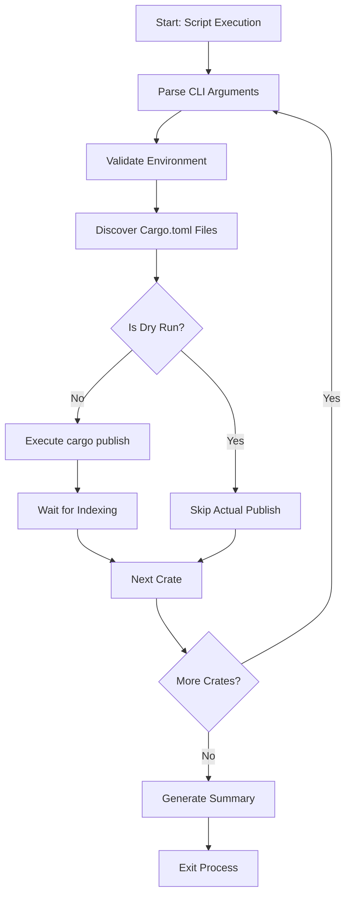

# Configuration & Execution Domain Technical Documentation

## Overview

The **Configuration & Execution Domain** serves as the foundational execution layer for the `cortex-mem-publish-tools` system, providing essential runtime services that enable the automation of Rust crate publishing and version management workflows. This domain is responsible for script orchestration, command-line interface (CLI) parsing, environment validation, and cross-cutting concerns such as colored terminal output and system command execution.

As a **Tool Support Domain**, it does not contain business logic but instead enables core domains—specifically the Version Management and Publishing Domains—by ensuring proper configuration, validating prerequisites, and managing execution context. The domain operates through two primary entry points defined in `package.json`: `update-versions.js` and `publish-crates.js`, both implemented as Node.js scripts with procedural architecture.

---

## Architecture and Components

### Component Structure

The Configuration & Execution Domain comprises two main sub-modules:

| Sub-Module | Primary Files | Responsibility |
|------------|---------------|----------------|
| **CLI Interface** | `publish-crates.js`, `update-versions.js` | Parses command-line arguments, provides help text, manages user interaction |
| **Environment Validator** | `publish-crates.js`, `update-versions.js` | Validates presence of required tools (Node.js, Git, cargo), checks runtime conditions |

These components are tightly integrated within the same files due to the system's flat, script-oriented architecture, avoiding formal modularization in favor of simplicity and maintainability.

---

## CLI Interface Implementation

### Entry Point Definition

Execution begins via npm scripts defined in `package.json`, which serve as the public interface for users:

```json
"scripts": {
  "update-versions": "node update-versions.js",
  "publish-crates": "node publish-crates.js",
  "publish-dry-run": "node publish-crates.js --dry-run"
}
```

Users interact with the tool using standard npm run commands:
- `npm run update-versions`
- `npm run publish-crates [--flags]`
- `npm run publish-dry-run`

This approach leverages npm as a task runner while maintaining direct control over script execution.

### Argument Parsing Mechanism

The CLI interface uses raw `process.argv` parsing rather than external libraries like `yargs` or `commander`. Arguments are processed manually after slicing off the first two elements (Node executable and script path):

```javascript
const args = process.argv.slice(2);
const dryRun = args.includes('--dry-run');
const skipWait = args.includes('--skip-wait');
const force = args.includes('--force');
```

Supported flags include:
- `--dry-run`: Simulates publishing without actual upload
- `--skip-wait`: Skips waiting for crates.io indexing between dependent crates
- `--force`: Republishes crates even if already published

No formal help system (`--help`) is currently implemented, though placeholder logic exists in research materials.

### User Interaction Design

The interface employs progressive disclosure and confirmation patterns to prevent accidental operations:

1. **Pre-execution Summary**: Displays all crates to be published with their versions and publication status
2. **Interactive Confirmation**: Requires Enter key press before proceeding with actual publication
3. **Real-time Feedback**: Shows step-by-step progress during execution
4. **Final Summary**: Provides comprehensive success/failure statistics

Example confirmation prompt:
```bash
⚠️  This will publish the above crates to crates.io
Press Ctrl+C to cancel, or press Enter to continue...
```

---

## Environment Validation

### Prerequisite Checks

While explicit validation functions (`checkNodeVersion`, `verifyGitAvailable`, etc.) are referenced in documentation, current implementation relies on implicit failure handling through system calls. However, the design intent includes:

- **Node.js Runtime Check**: Ensure compatible version
- **Git Availability**: Required for potential version commit operations
- **Cargo Installation**: Essential for publishing crates
- **Network Connectivity**: Implicitly required for crates.io interaction

Failure in any prerequisite typically results in a caught exception and graceful exit.

### Dependency Management

The only explicit runtime dependency is `glob`, used by `update-versions.js` for file discovery:

```json
"dependencies": {
  "glob": "^10.3.10"
}
```

A pre-flight check ensures its availability:
```javascript
try {
  require.resolve('glob');
} catch (e) {
  console.error('Error: The "glob" package is required but not installed.');
  console.error('Please install it with: npm install glob');
  process.exit(1);
}
```

This defensive programming pattern prevents cryptic errors from missing dependencies.

---

## Cross-Cutting Concerns

### Colored Terminal Output

Both scripts implement ANSI color formatting to enhance readability and convey semantic meaning:

```javascript
const colors = {
  reset: '\x1b[0m',
  bright: '\x1b[1m',
  red: '\x1b[31m',
  green: '\x1b[32m',
  yellow: '\x1b[33m',
  blue: '\x1b[34m',
  cyan: '\x1b[36m'
};

function colorize(text, color) {
  return `${colors[color]}${text}${colors.reset}`;
}
```

Color usage semantics:
- **Green**: Success, completion
- **Yellow**: Warnings, conversions, dry-run mode
- **Red**: Errors, failures
- **Blue/Cyan**: Informational messages, section headers
- **Bright**: Headings and important notices

Icons are also used for visual scanning:
- ✅ Success
- ⚠️ Warning
- ❌ Error
- 📦 Crate operations
- 🔍 Dry runs

### System Command Execution

Relies on Node.js `child_process.execSync` for executing external tools:

```javascript
const { execSync } = require('child_process');

// Used for:
execSync(`curl -s -f "https://crates.io/api/v1/crates/${crateName}"`);
execSync('cargo publish --allow-dirty', { cwd: crateDir, stdio: 'inherit' });
```

Key execution patterns:
- **Inherited stdio**: Allows cargo output to stream directly to user terminal
- **CWD specification**: Ensures commands execute in correct crate directory
- **Error suppression**: For probes like API checks where failure is expected
- **Synchronous execution**: Ensures ordered operation critical for dependency chains

---

## Execution Flow

### Control Flow Diagram



### State Management

The domain maintains minimal state, relying primarily on:
- **File System**: `Cargo.toml` files serve as the source of truth
- **Process Memory**: Transient storage of parsed arguments and discovered files
- **Temporary Backups**: `.bak` copies of original files during modification

No persistent configuration files or databases are used.

---

## Integration Points

### With Version Management Domain

Provides foundational services:
- File system access for reading/writing `Cargo.toml`
- Colored output for user feedback
- Execution context for version update operations
- Argument parsing for version bump parameters (future extension)

### With Publishing Domain

Enables safe and reliable publication:
- Validates environment readiness
- Manages interactive user confirmation
- Executes `cargo publish` commands
- Handles rollback via backup restoration
- Probes crates.io API for publication verification

### External System Interactions

| System | Purpose | Method |
|-------|--------|--------|
| **Git** | Not currently used for commits in this version | Potential future integration via `git add/commit` |
| **crates.io** | Publication target and status verification | Direct HTTP via `curl`, indirect via `cargo publish` |
| **Rust Toolchain** | Build and publish validation | `cargo publish --dry-run`, `cargo publish` |

---

## Key Functions Reference

| Function | File | Purpose |
|--------|------|--------|
| `colorize(text, color)` | Both scripts | Applies ANSI color codes to terminal output |
| `findCargoTomlFiles()` | `update-versions.js` | Discovers all manifest files using glob patterns |
| `main()` | Both scripts | Orchestrates execution flow and coordinates operations |
| `waitForCrateAvailability()` | `publish-crates.js` | Polls crates.io API to ensure indexed availability |
| `restoreCargoToml()` | `publish-crates.js` | Reverts temporary modifications after publishing |

---

## Strengths and Limitations

### Strengths

1. **Simple and Predictable**: Flat architecture reduces cognitive load
2. **User-Friendly Output**: Colorized interface improves usability
3. **Safe Execution Model**: Dry-run mode and confirmations prevent accidents
4. **Robust Error Handling**: Graceful exits with meaningful error messages
5. **Transparent Operations**: All actions are visible in real-time

### Limitations

1. **Manual Dependency List**: `CRATES_TO_PUBLISH` must be maintained manually
2. **No Dynamic Discovery**: Cannot auto-detect crate relationships
3. **Limited Validation**: Missing explicit checks for Node.js/Git versions
4. **No Help System**: Lacks `--help` flag support
5. **Unix-Centric Tools**: Relies on `curl`, potentially limiting Windows compatibility

---

## Best Practices and Recommendations

### Usage Guidelines

1. Always test with `--dry-run` before actual publication
2. Use `--force` cautiously when republishing existing versions
3. Monitor network connectivity to crates.io during long sequences
4. Review the pre-publish summary carefully before confirming
5. Keep `CRATES_TO_PUBLISH` array updated with dependency order

### Future Improvements

1. **Implement Full CLI Help**: Add `--help` flag with usage documentation
2. **Add Environment Checks**: Explicit validation of Node.js, Git, and cargo
3. **Support Semantic Versioning Flags**: Allow `--patch`, `--minor`, `--major`
4. **Improve Windows Compatibility**: Replace `curl` with cross-platform alternatives
5. **Add Configuration File Support**: Allow customization without code changes

---

## Conclusion

The Configuration & Execution Domain effectively serves as the operational backbone of the `cortex-mem-publish-tools` system, providing a robust, user-friendly interface for automating complex release workflows. By focusing on simplicity, safety, and clarity, it enables developers to reliably manage multi-crate publications with minimal risk of error.

Its tight integration with both internal domains and external systems demonstrates a pragmatic approach to tooling—prioritizing immediate utility over theoretical elegance. While opportunities exist for enhancement, particularly around dynamic discovery and platform compatibility, the current implementation successfully fulfills its role as a dependable execution environment for Rust crate management.