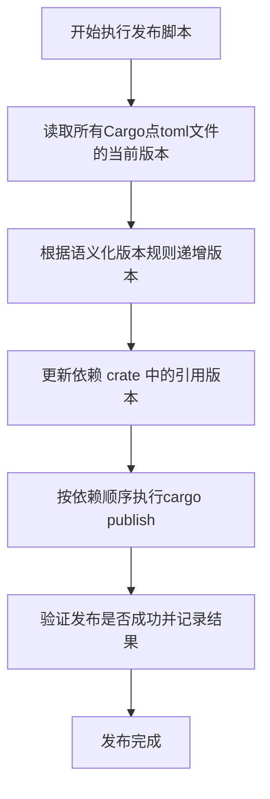

# **Publishing Domain Technical Documentation**

**Document Generated On:** 2025-12-31 16:46:56 UTC  
**System:** `cortex-mem-publish-tools`  
**Domain:** Publishing Domain  
**Primary Module:** Cargo Publisher  
**Implementation File:** `publish-crates.js`

---

## **1. Overview**

The **Publishing Domain** is a core business component of the `cortex-mem-publish-tools` system, responsible for orchestrating the publication of Rust crates to the official package registry, **crates.io**. This domain acts as the final execution layer in the release workflow, transforming locally managed crates into publicly available packages.

It operates in close coordination with the **Version Management Domain** to ensure that only correctly versioned and dependency-consistent crates are published. The domain's primary responsibility is to execute the `cargo publish` command safely, handle authentication, validate publication success, and manage the temporary modifications required to make path-based dependencies compatible with crates.io.

This documentation provides a comprehensive technical analysis of the Publishing Domain, covering its responsibilities, implementation, workflow, error handling, and integration points.

---

## **2. Core Responsibilities**

The Publishing Domain is responsible for the following key operations:

1.  **Publication Orchestration:** Execute the `cargo publish` command for a predefined list of crates in a specific, dependency-ordered sequence.
2.  **Dependency Transformation:** Temporarily convert internal `path = "../..."` dependencies in `Cargo.toml` files to version-based `version = "X.Y.Z"` dependencies, which is a requirement for publishing to crates.io.
3.  **State Management:** Create backups of original `Cargo.toml` files before modification and restore them after publication (whether successful or failed) to maintain repository integrity.
4.  **Publication Validation:** Verify the success of a publish operation by checking the crates.io API to confirm the crate is available and indexed.
5.  **Sequential Dependency Handling:** Implement a waiting mechanism to ensure a published crate is available on crates.io before publishing a crate that depends on it.
6.  **User Interaction & Feedback:** Provide clear, colorized terminal output to guide the user through the process, including dry-run capabilities and confirmation prompts.

---

## **3. Key Module: Cargo Publisher**

The entire functionality of the Publishing Domain is encapsulated within the **Cargo Publisher** module, implemented in the `publish-crates.js` script.

### **3.1. Key Functions**

| Function | Description |
| :--- | :--- |
| `prepareForPublishing(cratePath)` | Scans a crate's `Cargo.toml` for `path` dependencies. For each internal dependency (e.g., `cortex-mem-core`), it looks up the current version from the monorepo and replaces the `path` directive with a `version` directive (e.g., `{ path = "../core" }` → `{ version = "1.0.0" }`). It creates a `.bak` backup of the original file before making changes. |
| `restoreCargoToml(cratePath)` | Restores the original `Cargo.toml` file from its `.bak` backup. This function is called after every publish attempt to ensure the local repository state is clean. |
| `publishCrate(cratePath, dryRun)` | Executes the `cargo publish` command in the specified crate's directory. It supports a `dryRun` mode that uses `cargo publish --dry-run --allow-dirty` to validate the package without actually publishing it. It uses `child_process.execSync` to run the command and inherits stdio for real-time output. |
| `waitForCrateAvailability(crateName, maxWaitSeconds)` | After a successful publish, this function polls the `crates.io/api/v1/crates/{name}` endpoint using `curl` to verify that the crate is available and indexed. It retries every 5 seconds until the crate is found or a timeout (default 120 seconds) is reached. This ensures dependent crates can be published in sequence. |
| `isCratePublished(crateName)` | Checks the crates.io API to determine if a crate with the given name and version is already published. This is used to skip crates that have already been released, unless the `--force` flag is used. |
| `hasPathDependencies(cratePath)` | A helper function that quickly checks if a crate's `Cargo.toml` contains any `path` dependencies, which determines if `prepareForPublishing` needs to be invoked. |

---

## **4. Workflow and Execution Flow**

The Publishing Domain's workflow is initiated by running `npm run publish-crates` (or `node publish-crates.js`). The process follows a strict sequence:



1.  **Initialization & Discovery:** The script reads the `CRATES_TO_PUBLISH` array, which defines the list of crates and their publication order based on dependency hierarchy.
2.  **Version & State Check:** For each crate, it retrieves the current version from its `Cargo.toml` and checks if it is already published on crates.io.
3.  **Preparation:** If the crate has `path` dependencies, `prepareForPublishing` is called to modify the `Cargo.toml` and create a backup.
4.  **Dry-Run Validation:** A `cargo publish --dry-run` is executed to catch any errors (e.g., missing metadata, build failures) before the actual publish.
5.  **Actual Publication:** If the dry-run passes, the script executes `cargo publish --allow-dirty` to publish the crate to crates.io. The `--allow-dirty` flag is necessary because the `Cargo.toml` has been modified.
6.  **Post-Publish Validation:** Upon successful publication, `waitForCrateAvailability` is called to poll the crates.io API and confirm the crate is live.
7.  **State Restoration:** The original `Cargo.toml` is restored using `restoreCargoToml`, regardless of the publish outcome.
8.  **Iteration:** The process repeats for the next crate in the list.

---

## **5. Integration and Dependencies**

The Publishing Domain does not operate in isolation and has critical interactions with other domains and external systems.

### **5.1. Internal Dependencies**

*   **Version Management Domain:** This is a **Data Dependency** of the highest strength (9.0). The Publishing Domain relies on the Version Management Domain (via `update-versions.js` or shared logic) to ensure all crates have consistent, up-to-date versions before publication begins. Publishing a crate with an outdated dependency version would break the ecosystem.
*   **Configuration & Execution Domain:** This is a **Service Call** dependency. The Publishing Domain uses functions from this domain for:
    *   **CLI Argument Parsing:** To interpret flags like `--dry-run`, `--skip-wait`, and `--force`.
    *   **Environment Validation:** To ensure `cargo`, `git`, and `curl` are available on the system path.
    *   **Terminal Output:** To provide colorized and formatted feedback to the user.

### **5.2. External System Interactions**

*   **crates.io (Service Call - Strength 10.0):** The primary external interaction. The domain uses two methods:
    1.  **`cargo publish` CLI:** The main mechanism for uploading the crate package.
    2.  **crates.io REST API (`GET /api/v1/crates/{name}`):** Used directly via `curl` to validate publication status and check for existing crates, providing more reliable feedback than parsing `cargo` output.
*   **Git (Tool Support):** While the Publishing Domain itself does not commit changes, it relies on the `Cargo.toml` files being in a state managed by Git. The `--allow-dirty` flag allows publication from a working directory with uncommitted changes (the temporary `Cargo.toml` modifications).

---

## **6. Error Handling and Resilience**

The domain implements several mechanisms to handle failures and maintain system integrity:

*   **Atomic File Operations:** By backing up `Cargo.toml` files before modification and restoring them afterward, the script ensures that the local repository is never left in a broken state, even if the script crashes.
*   **Dry-Run First:** Every publish attempt is preceded by a dry-run, which catches most potential errors (e.g., build failures, missing license) before any network operation occurs.
*   **Graceful Failure:** If a publish fails, the script logs the error, restores the `Cargo.toml` file, increments a failure counter, and continues to the next crate (if possible). The process only exits with a failure code if one or more crates fail to publish.
*   **Timeout Handling:** The `waitForCrateAvailability` function has a configurable timeout. If a crate is not available within the allotted time, the script issues a warning but continues, allowing the user to proceed or investigate manually.
*   **Authentication:** The script relies on the user's existing `cargo` authentication setup (typically via `~/.cargo/credentials`). It does not handle token management directly but depends on the `cargo` CLI to manage authentication during the `publish` command.

---

## **7. Configuration and Usage**

The behavior of the Publishing Domain is controlled through command-line arguments and a static configuration in the script.

### **7.1. Configuration**

*   **`CRATES_TO_PUBLISH` Array:** A hard-coded list in `publish-crates.js` that defines the name and relative path of each crate to be published, in the correct dependency order. This must be manually maintained.
*   **`maxWaitSeconds`:** The maximum time (in seconds) to wait for a crate to appear on crates.io after publication (default: 120).

### **7.2. Command-Line Flags**

| Flag | Purpose |
| :--- | :--- |
| `--dry-run` | Simulates the entire publication process without uploading any packages. Useful for validation. |
| `--skip-wait` | Skips the `waitForCrateAvailability` step after each publish, speeding up the process if dependency indexing is not a concern. |
| `--force` | Forces the publication of a crate even if it is already published on crates.io (use with caution). |

### **7.3. Execution**

```bash
# Perform a dry-run to validate the process
npm run publish-dry-run

# Publish all crates (with interactive confirmation)
npm run publish-crates

# Publish with flags
node publish-crates.js --dry-run --skip-wait
```

---

## **8. Strengths and Limitations**

### **Strengths**

*   **Reliable State Management:** The backup-and-restore pattern for `Cargo.toml` files is a robust solution for temporary modifications.
*   **Clear User Feedback:** Colorized output and a detailed summary provide excellent visibility into the process.
*   **Effective Validation:** Using the crates.io API directly for validation is more reliable than relying solely on `cargo`'s output.
*   **Safe Orchestration:** The dependency-ordered publication with waiting ensures that dependent crates can be built correctly.

### **Limitations**

*   **Hard-Coded Crate List:** The `CRATES_TO_PUBLISH` array requires manual updates when new crates are added, which can lead to errors.
*   **No Dynamic Dependency Resolution:** The script does not parse `Cargo.toml` files to build a dependency graph dynamically. The order is fixed.
*   **Limited Error Recovery:** While it handles individual crate failures, it does not implement retry logic for transient network errors during publication.
*   **Manual Authentication:** Relies on the user's pre-configured `cargo` credentials, with no built-in mechanism for token refresh or management.

---

## **Conclusion**

The Publishing Domain in `cortex-mem-publish-tools` is a well-defined, focused module that effectively solves the critical problem of safely and reliably publishing multiple interdependent Rust crates to crates.io. Its strength lies in its pragmatic approach to state management and its robust validation mechanisms. While it has limitations in terms of dynamism and error recovery, its design prioritizes simplicity, reliability, and developer trust, making it a valuable tool for teams managing multi-crate Rust projects.