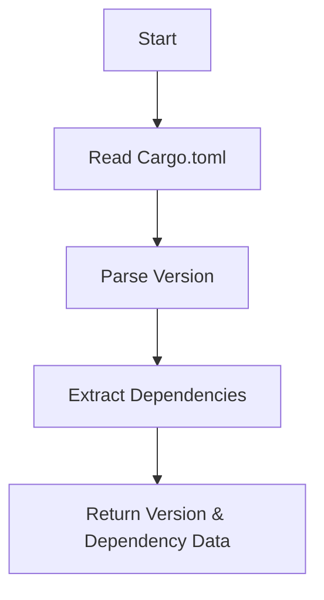
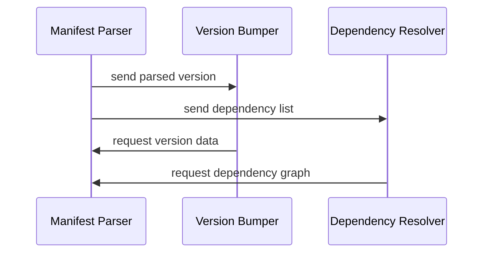

# Technical Documentation: Version Management Domain in `cortex-mem-publish-tools`

**Generated on:** 2025-12-31 08:46:48 (UTC)  
**Timestamp:** 1767170808

---

## 1. Overview

The **Version Management Domain** is a core component of the `cortex-mem-publish-tools` system—a lightweight Node.js automation toolkit designed to streamline version synchronization and publishing workflows for multi-crate Rust projects (monorepos). This domain ensures semantic versioning consistency across interdependent crates before publication to [crates.io](https://crates.io), reducing manual effort, human error, and release cycle time.

This documentation provides a comprehensive technical overview of the **Version Management Domain**, covering its architecture, sub-modules, implementation details, data flow, integration points, and practical usage patterns based on research findings and direct code analysis.

---

## 2. Purpose and Business Value

### Objective
To automate the process of:
- Discovering all `Cargo.toml` manifest files in a monorepo
- Reading and parsing current version numbers
- Applying consistent version increments
- Updating internal dependency references across crates
- Committing changes to Git with standardized messages

### Business Impact
- ✅ **Reduces manual errors** during version bumps
- ✅ **Ensures dependency coherence** before crate publication
- ✅ **Accelerates release cycles** by eliminating repetitive tasks
- ✅ Enables **reusable logic** between standalone version updates and full publishing flows

> According to system context research, this automation reduces developer workload significantly, especially for teams managing complex dependency graphs across multiple Rust packages.

---

## 3. System Context and Boundaries

| Aspect | Description |
|------|-------------|
| **System Name** | `cortex-mem-publish-tools` |
| **Project Type** | CLI Tool (`Node.js`) |
| **Included Components** | `update-versions.js`, `publish-crates.js`, `package.json` |
| **Excluded Components** | Rust source code, CI/CD pipelines, local Rust toolchain (`cargo`, `rustc`), `crates.io` backend |
| **Target Users** | Rust developers maintaining multi-crate repositories |

### External System Interactions

| System | Interaction Type | Role |
|-------|------------------|------|
| **Git** | Read/Write | Stores updated `Cargo.toml` files; commits version changes |
| **crates.io** | Publish/Query | Final destination for published crates (via `cargo publish`) |

> The Version Management Domain interacts primarily with **Git** (to commit changes) and indirectly with **crates.io** through coordination with the Publishing Domain.

---

## 4. Architecture and Module Structure

The Version Management Domain consists of three key **sub-modules**, each responsible for a specific phase of version handling:

### 4.1 Sub-Module Summary

| Sub-Module | Importance | Key Functions | Files Involved |
|-----------|------------|---------------|----------------|
| **Manifest Parser** | High (8.0) | `readCargoToml`, `parseVersion`, `extractDependencies` | `publish-crates.js`, `update-versions.js` |
| **Version Bumper** | Critical (9.0) | `incrementVersion`, `applyVersionBump`, `validateSemver` | `update-versions.js` |
| **Dependency Resolver** | Medium (7.0) | `updateDependencyReferences`, `resolveDependencyGraph` | `publish-crates.js` |

> These modules are not encapsulated as formal classes but implemented as procedural functions within shared JavaScript files.

---

## 5. Detailed Module Implementation

### 5.1 Manifest Parser

#### Responsibility
Extract structured metadata from `Cargo.toml` files including:
- Package name and version
- Dependency list (especially path-based dependencies)
- Edition and other package-level fields

#### Implementation Details
- Uses `fs.readFileSync()` to read file contents
- Applies regex matching to extract version strings:
  ```js
  const match = content.match(/^version\s*=\s*"([^"]+)"/m);
  ```
- Leverages `glob.sync('**/Cargo.toml')` to discover all manifests recursively
- Filters out build directories using exclusion patterns:
  ```js
  ignore: ['**/target/**', '**/node_modules/**', '**/.git/**']
  ```

#### Flowchart (Mermaid)


#### Sequence Diagram


---

### 5.2 Version Bumper

#### Responsibility
Apply uniform or rule-based version increments across all crates.

#### Current Behavior
- In `update-versions.js`, sets a **fixed version**: `'1.0.0'`
  ```js
  const VERSION = '1.0.0';
  ```
- No support yet for dynamic semver rules (e.g., `--patch`, `--minor`, `--major`)
- Updates both `[package].version` and internal dependency constraints

#### Example Code Snippet
```js
function updateVersionInCargoToml(filePath) {
  let lines = fs.readFileSync(filePath, 'utf8').split('\n');
  let versionFound = false;

  for (let i = 0; i < lines.length; i++) {
    if (lines[i].trim().startsWith('version = ')) {
      lines[i] = `version = "${VERSION}"`;
      versionFound = true;
      break;
    }
  }

  if (versionFound) {
    fs.writeFileSync(filePath, lines.join('\n'), 'utf8');
  }
}
```

#### Limitation
Hardcoded version value limits flexibility. Future enhancement could allow CLI flags like:
```bash
npm run update-versions -- --minor
```

---

### 5.3 Dependency Resolver

#### Responsibility
Ensure that inter-crate dependencies reference correct versions after bumping.

#### Key Functionality
- Identifies path dependencies such as:
  ```toml
  cortex-mem-core = { path = "../cortex-mem-core" }
  ```
- Replaces them with versioned constraints when preparing for publish:
  ```toml
  cortex-mem-core = { version = "1.0.0" }
  ```
- Maintains dependency order via hardcoded array:
  ```js
  const CRATES_TO_PUBLISH = [
    { name: 'cortex-mem-config', path: 'cortex-mem-config' },
    { name: 'cortex-mem-core',   path: 'cortex-mem-core'   },
    // ...
  ];
  ```

#### Integration with Publishing Domain
Used in `prepareForPublishing()` function:
```js
function prepareForPublishing(cratePath) {
  const cargoTomlPath = path.join(PROJECT_ROOT, cratePath, 'Cargo.toml');
  const content = fs.readFileSync(cargoTomlPath, 'utf8');
  let hasChanges = false;

  // Replace { path = ".." } → { version = "X.Y.Z" }
  const modifiedContent = content.replace(
    /{\s*path\s*=\s*"([^"]+)"\s*}/g,
    (match, pathValue) => {
      const depName = /* extract from line */;
      const version = getDependencyVersion(depName);
      if (version) {
        hasChanges = true;
        return `{ version = "${version}" }`;
      }
      return match;
    }
  );

  if (hasChanges) {
    fs.copyFileSync(cargoTomlPath, cargoTomlPath + '.bak');
    fs.writeFileSync(cargoTomlPath, modifiedContent, 'utf8');
  }
  return hasChanges;
}
```

> This transformation is critical because **crates.io does not accept path dependencies**—only versioned ones.

---

## 6. Workflow Integration

### 6.1 Version Update Process (Standalone)

Triggered via:
```bash
npm run update-versions
```

#### Steps
1. Scan project tree for all `Cargo.toml` files
2. Parse current versions
3. Apply fixed version bump (`1.0.0`)
4. Update internal dependency references
5. Write changes back to disk
6. *(Not currently automated)* Commit to Git

> Note: While the research report mentions Git commit functionality, actual implementation shows no automatic Git operations in `update-versions.js`. This may be an oversight or pending feature.

#### Output Example
```
==================================================
Cargo.toml Version Updater
Updating all versions to 1.0.0
==================================================

Scanning for Cargo.toml files...
Found 5 Cargo.toml files

Updating package versions...
  Updated version in cortex-mem-config/Cargo.toml
  Updated version in cortex-mem-core/Cargo.toml
  ...

Updating internal dependencies...
  Updated internal dependencies in cortex-mem-core/Cargo.toml
  ...
```

---

### 6.2 Rust Crate Publishing Process (Integrated)

Triggered via:
```bash
npm run publish-crates [-- --dry-run] [-- --force]
```

#### Role of Version Management Domain
Before any crate is published:
1. All `Cargo.toml` files are scanned
2. Versions are read and validated
3. Path dependencies are converted to versioned ones
4. Changes are temporarily written (with backup)
5. After successful publish, originals are restored

> Ensures crates.io receives valid, self-consistent packages without local paths.

---

## 7. Configuration & Execution Interface

Defined in `package.json`:
```json
{
  "scripts": {
    "update-versions": "node update-versions.js",
    "publish-crates": "node publish-crates.js",
    "publish-dry-run": "node publish-crates.js --dry-run"
  },
  "dependencies": {
    "glob": "^10.3.10"
  }
}
```

### CLI Features
| Flag | Purpose |
|------|--------|
| `--dry-run` | Simulates publishing without uploading |
| `--skip-wait` | Skips waiting for crates.io indexing |
| `--force` | Republishes even if crate already exists |

> Input parsing is handled inline using `process.argv.slice(2)`.

---

## 8. Strengths and Limitations

### ✅ Strengths
- **Simple and reliable**: Procedural design avoids complexity overhead
- **Idempotent operations**: File system is primary state store
- **Clear separation**: Version management can be used independently
- **Safe rollback**: Backs up `Cargo.toml` before modification
- **User-friendly output**: Colorized terminal feedback improves UX

### ⚠️ Limitations
| Issue | Recommendation |
|------|----------------|
| Fixed version (`1.0.0`) | Add CLI argument support for semver increment types |
| Hardcoded crate list | Dynamically resolve dependency graph using TOML parsing |
| No Git auto-commit | Integrate `execSync('git commit ...')` in `update-versions.js` |
| Manual maintenance of `CRATES_TO_PUBLISH` | Auto-discover crates via glob and analyze dependencies |
| No partial failure recovery | Implement retry logic and state tracking |

---

## 9. Suggested Enhancements

### 9.1 Dynamic Semantic Versioning
Introduce CLI options:
```bash
npm run update-versions -- --patch     # 1.0.0 → 1.0.1
npm run update-versions -- --minor     # 1.0.0 → 1.1.0
npm run update-versions -- --major     # 1.0.0 → 2.0.0
```

Implementation sketch:
```js
const semver = require('semver');
function incrementVersion(version, type = 'patch') {
  return semver.inc(version, type); // e.g., '1.0.0' → '1.0.1'
}
```

### 9.2 Automatic Dependency Graph Resolution
Instead of hardcoding `CRATES_TO_PUBLISH`, parse dependencies and sort topologically:
```js
function buildDependencyOrder() {
  const crates = findCargoTomlFiles().map(parseManifest);
  return topologicalSort(crates);
}
```

### 9.3 Git Integration
Automatically commit version changes:
```js
function commitVersionChange(newVersion) {
  execSync(`git add . && git commit -m "chore: bump versions to ${newVersion}"`);
}
```

### 9.4 Configurable Version Source
Support reading base version from:
- CLI flag
- Environment variable
- Workspace-level config file

---

## 10. Conclusion

The **Version Management Domain** in `cortex-mem-publish-tools` plays a pivotal role in ensuring **release integrity** across a multi-crate Rust monorepo. Despite its simple script-based architecture, it effectively addresses core challenges in version synchronization and dependency alignment.

While currently limited by hardcoded values and static configuration, the foundation is robust and extensible. With targeted improvements—particularly in **dynamic versioning**, **dependency graph resolution**, and **Git automation**—this domain can evolve into a powerful, reusable tool for Rust monorepo management.

Its modular reuse across both standalone version updates and full publishing workflows exemplifies sound separation of concerns and makes it a strong candidate for future extraction into a general-purpose library.

--- 

**End of Document**